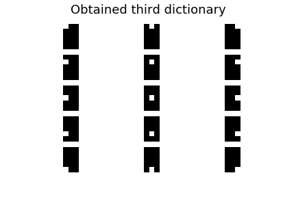

# Dictionnary-Learning-for-Sparse-Representations

This work contains the work done in the project _Recent Advances in Machine Learning_.

Here we provide a general view of the theme, implemeting in the **Julia** language 3 papers:

K-SVD: https://sites.fas.harvard.edu/~cs278/papers/ksvd.pdf (Based on the implementation of Ishita Takeshi).

GDDL _(Greedy Deep Dictionary Learning)_ : https://arxiv.org/pdf/1602.00203.pdf

Online Dictionary Learning for Sparse Coding: https://www.di.ens.fr/sierra/pdfs/icml09.pdf

Each paper is implemented in a different Jupyter Notebook, so that you can test them.

We have used for our experiments the MNIST dataset and the CIFAR dataset:

# Results 

K-SVD (Task: Compression, MNIST):

Original:

Reconstructed (95% of sparsity):

GDDL (Task: Interpretability,MNIST):

Layers of the encoder:

Online Dictionary Learning for Sparse Coding (Task: Compression,CIFAR)

Original:

Reconstructed (95% of sparsity):

